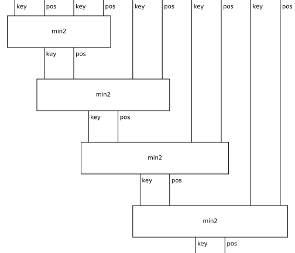
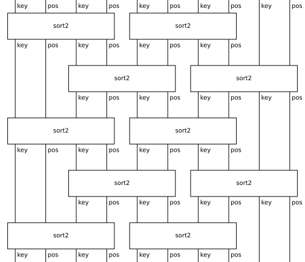
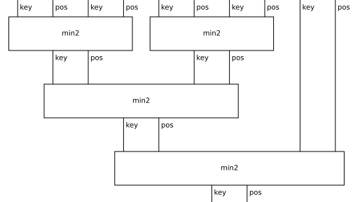

# Map neural networks on CLRS

Stage 1 of [discopy#678](https://github.com/discopy/discopy/issues/678):
the beachhead adapter and the first two tasks end to end, porting the
geometry-of-interaction learning pipeline of
[discopy#677](https://github.com/discopy/discopy/pull/677) from Church
arithmetic to the [CLRS Algorithmic Reasoning
Benchmark](https://github.com/google-deepmind/clrs).

The thesis on CLRS's turf: a fully-connected GNN processor does not
enforce the algorithm's dataflow — in a map neural network **the wiring
is the algorithm**, and only the primitive boxes are learned, supervised
at their own boundaries from the reference implementation's traffic.
CLRS's test axis — train at n = 16, test out of distribution at n = 64 —
then probes structure the model has by construction: the boxes never
see n. The division of labour is stated plainly: the boxes are learned,
the wiring is given, and the controls below measure exactly what the
given wiring contributes.

Framed fairly against the field: it is well established that more
structure makes neural algorithmic solvers better (algorithmic
alignment, the NAR blueprint, and the hint trajectories themselves are
structure supplied through the loss), and the open difficulty is the
tradeoff between structure and generality. The baselines deliberately
sit mid-axis -- one processor for thirty algorithms. This experiment
charts the *endpoint* of the structure axis, which that literature
discusses but had not measured: what maximal structure buys (exactness,
orders of magnitude fewer parameters, out-of-distribution behaviour by
construction) and what it costs (a given wiring per task). The
contribution beyond the endpoint is evidence that it costs less
generality than assumed: the primitive is learnable from input-output
pairs alone, it transfers across tasks zero-shot, and the wiring is the
one given left, with parsing as the path to learning it.

The wirings, drawn by [DisCoPy](https://github.com/discopy/discopy) at
five pairs — the left-comb fold of `minimum`, the odd-even transposition
network of `insertion_sort`, and the balanced tournament of the wiring
control:





## The `minimum` task

CLRS's reference `minimum` is a left fold of one comparison, here the
left-comb diagram over one generator `min2 : pair @ pair -> pair` in the
free symmetric monoidal category (a pair is a key wire and a position
wire), run by a DisCoPy functor into Python functions with JAX arrays on
the wires — applied one layer at a time, which agrees by functoriality
and keeps the call depth flat.

The first thing #678 asked to establish — comparator keys are
real-valued, so the rule tables must quotient over key values — holds on
the recorded traffic: every visit of the reference box copies one of its
two input pairs exactly, and which one is a function of the predicate
`key1 > key2` alone. Fifteen thousand visits collapse to **two rules**;
the one learned component is a two-layer MLP for the predicate (Adam
with a Polyak-averaged tail), with the routing kept exact.

Scored by `clrs._src.evaluation.evaluate`, the exact function behind the
published numbers, over model seeds 0, 1, 2:

| split | predicate box | value-bottleneck ablation |
|---|---|---|
| val, 32 × n=16 | 100.00 ± 0.00 | 98.96 ± 1.47 |
| test, 32 × n=64 (CLRS protocol) | **95.83 ± 1.47** | 85.42 ± 8.96 |
| wide test, 1000 × n=64 | 98.67 ± 1.05 | 83.30 ± 9.61 |
| far, 32 × n=256 | **97.92 ± 1.47** | 40.62 ± 33.17 |

The protocol is the benchmark's own, verified against the paper: 1,000
training trajectories, 32 validation, 32 out-of-distribution test
trajectories at 64 nodes ([Veličković et al. 2022](https://arxiv.org/abs/2205.15659),
§4). The best of the benchmark's five baselines reaches **87.71 ± 0.52**
on this task (PGN; table 2 of the paper), and the later single-task
state of the art is Triplet-GMPNN at **97.78 ± 0.55**
([Ibarz et al. 2022](https://arxiv.org/abs/2209.11142), table 2 —
verified from the paper) — a little above the oracle-trained box at
n = 64, which in exchange shows essentially no further degradation at
n = 256, sixteen times the training size. Their baselines train one to
thirty hours per task on a V100; everything here is minutes of CPU. The parameter
counts are not at par: the predicate MLP is **322 parameters**, the whole
learned model, against **392,892** for the single-task Triplet-GMPNN
instantiated on the `minimum` spec with this repository's own defaults
(`hidden_size=128`, `nb_triplet_fts=8`) — the baseline spends ~1,200×
more parameters learning the dataflow that the wiring provides here for
free. The learned predicate agrees with the reference on 99.91–99.97% of
the n = 64 traffic and all its errors lie in a band |key1 − key2| < 0.005;
since routing is exact, the residual score gap *is* that band. The
ablation — the same wiring with the box regressing the smaller key, the
pointer decoded back from the value — collapses out of distribution: the
discrete interface is what generalizes.

## Controls: what the given wiring does and does not smuggle in

`python -m goi.run_controls` (seed 0):

| model | test (n=64) | wide (n=64) | far (n=256) |
|---|---|---|---|
| 322-parameter predicate, left comb | 96.88 | 99.20 | 96.88 |
| **392,892**-parameter predicate, left comb | 93.75 | 98.90 | 100.00 |
| 322-parameter predicate, **balanced tournament** | 96.88 | 99.20 | 96.88 |
| 322-parameter predicate, **half the keys folded** | 46.88 | 48.50 | 56.25 |

Widening the predicate to exactly the baseline's budget gains nothing,
so the 1,200× ratio is structural, not tuning. The same box moved to a
different *correct* wiring scores identically — the wiring prior is
associativity, which any correct fold shape satisfies — while a wiring
that folds only half the keys collapses to chance: the wiring carries
exactly the algorithmic information claimed, no more and no less. One
honest asymmetry: the reverse parameter match is reported, not settled —
the smallest *instantiable* Triplet-GMPNN is 82 parameters at hidden
dimension one, where it cannot represent the task; training that control
is future work.

## The `insertion_sort` task

CLRS scores sorting at the function level: each node's predecessor in
sorted order, trace-independent. The wiring is the odd-even transposition
network — `length` alternating layers of one compare-exchange generator
`sort2 : pair @ pair -> pair @ pair` — and the recorded traffic quotients
exactly as before: 120,000 visits collapse to **two rules** (pass or
exchange) keyed by the same predicate `key1 > key2`. Sorting is the
stress test of the one caveat above: it must resolve *every* adjacent
pair of the sorted order, however close, so the predicate reads the
difference of its two keys explicitly (an affine re-encoding) and trains
longer — **1,538 parameters**, still ~255× under the baseline. Scored by
CLRS's pointer metric over seeds 0, 1, 2:

| split | predicate box |
|---|---|
| val, 32 × n=16 | 100.00 ± 0.00 |
| test, 32 × n=64 (CLRS protocol) | **96.24 ± 0.00** |
| wide test, 1000 × n=64 | 96.97 ± 0.03 |
| far, 32 × n=256 | 88.41 ± 0.08 |

The benchmark's own baselines reach at best **71.42 ± 0.86** on
insertion sort and **73.58 ± 0.78** on bubble sort (Memnet; Veličković
et al. 2022, table 2 — verified from the paper), and the later
Triplet-GMPNN reaches **78.14 ± 4.64** on insertion sort and
**67.68 ± 5.50** on bubble sort (Ibarz et al. 2022, table 2 — verified
from the paper). Bubble sort shares this experiment
verbatim: CLRS distinguishes the two sorts only through their hint
trajectories, so a trace-free model scores them identically by
construction — where three of the four baselines pay measurably for
bubble's longer trace (Triplet-GMPNN 78.14 → 67.68, PGN 44.37 → 6.01,
MPNN 19.81 → 5.27); only Memnet, the weakest of them on insertion sort,
is flat across the pair at 71.42 → 73.58. The far
split degrades honestly and predictably: the minimal adjacent gap of n
uniform keys shrinks like 1/n², so a fixed predicate band meets more
unresolvable ties as n grows — the whole residual error is that band,
since the exchange routing is exact.

## One comparator, two algorithms

The two tasks do not just use similar boxes — their traffic quotients to
the *same* predicate. Deployed **zero-shot** in `minimum`'s wiring, the
sort-trained predicate scores 100.00 / 93.75 / 99.20 / 96.88 across the
four splits, indistinguishable from the natively trained one. The
multi-task claim for map neural networks is therefore not one monolithic
processor but **one library of learned primitives, shared exactly where
the algorithms share primitives**: every further comparator-family task
costs zero new parameters, and the wiring is the task's input, not a
model.

## End to end: the primitive learned from outputs alone

Everything above still hands the box its answers: the predicate trains
against the reference comparator's per-visit labels. This rung removes
that. The wiring is still given, the primitive is not -- the same MLPs,
the same **322** and **1,538** parameters, trained through a soft
relaxation of the routing itself, with CLRS's own output the only
supervision. Each fold step mixes the running pair by the predicate's
own probability, so the final position distribution is differentiable;
the transposition network does the same at every compare-exchange. No
oracle, no boundary labels, no hints. At test the routing is hard again
and the trained predicate drops into the exact wiring unchanged.

| split | `minimum` | `insertion_sort` |
|---|---|---|
| val, 32 × n=16 | 100.00 ± 0.00 | 100.00 ± 0.00 |
| test, 32 × n=64 (CLRS protocol) | **97.92 ± 1.47** | **98.97 ± 0.12** |
| wide test, 1000 × n=64 | 99.13 ± 0.26 | 98.83 ± 0.08 |
| far, 32 × n=256 | 96.88 ± 0.00 | 95.52 ± 0.34 |

Model seeds 0, 1, 2, scored by the same `clrs._src.evaluation.evaluate`.
Both beat their own oracle-trained boxes at the protocol test -- 97.92
against 95.83 on `minimum`, 98.97 against 96.24 on `insertion_sort` --
and on the far split the network gains seven points, 95.52 against
88.41. Weaker supervision scoring higher wants an explanation; the
likeliest one is that the oracle weights every visit alike, including
the near-ties whose resolution the fold never depends on, while the
output loss weights a visit by the damage it does downstream. That is a
reading of the numbers, not a measurement. What is measured is that the
end-to-end predicate agrees with the comparator it was never shown on
99.88--99.94% of the n = 64 traffic. The one split where it does not win
is `minimum`'s far, 96.88 against 97.92.

Against the literature this is `insertion_sort` at **98.97 ± 0.12**
where the single-task state of the art is 78.14 ± 4.64 and the best
benchmark baseline 71.42 ± 0.86, and `minimum` at par with its 97.78 ±
0.55 -- from input-output pairs alone, in minutes of CPU: about 16
seconds a seed for the fold, five minutes for the network.

## Run it

Sampling goes through `clrs._src.samplers` on the fly, so the heavy
dataset dependencies (TensorFlow, tfds) are not needed — `goi.stubs`
registers import-time placeholders for them.

```shell
python -m venv .venv && . .venv/bin/activate
pip install numpy jax attrs absl-py chex dm-haiku optax ml_collections \
    six opt-einsum matplotlib pytest
pip install git+https://github.com/discopy/discopy@main
python -m goi.run_minimum     # ~75s per seed on CPU
python -m goi.run_sort        # ~10min per seed on CPU
python -m goi.run_controls    # ~15min on CPU
python -m goi.run_endtoend         # minimum from outputs alone, ~16s per seed
python -m goi.run_endtoend sort    # the network from outputs alone, ~5min per seed
python -m goi.run_lcs              # lcs_length, with the truth-table diagnostics
python -m pytest goi/minimum_test.py goi/sort_test.py
```

## Next, per the staged plan

`bubble_sort` is free (the same network and box family), then
`lcs_length` or `matrix_chain_order` (message passing on a grid map,
with its own small cell primitive joining the library), then
`binary_search` as the feedback/stream instance, where the control flow
is data-dependent and no static wiring is the algorithm. Beyond that,
the wiring itself becomes the learned object: a map's wiring is a
perfect matching on typed ports — exactly a proof net's axiom linking —
so predicting it is parsing, with DisCoPy's map validation as the
correctness criterion and the exact executor as a sharp scorer of
candidate wirings.
